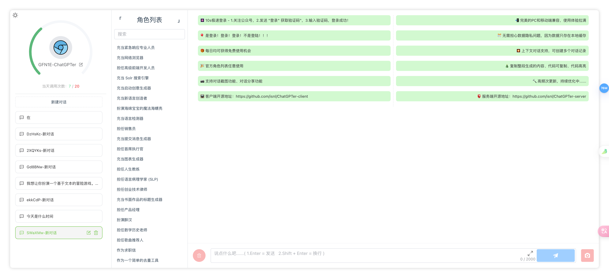
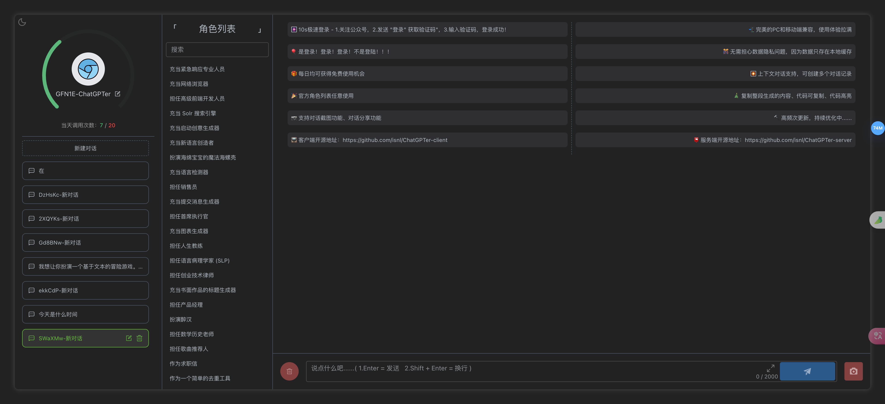
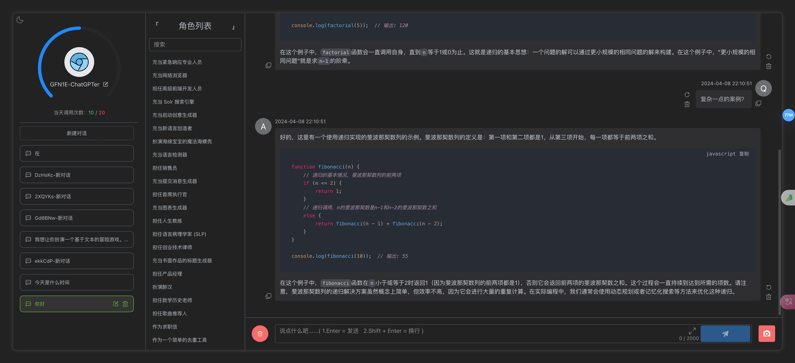
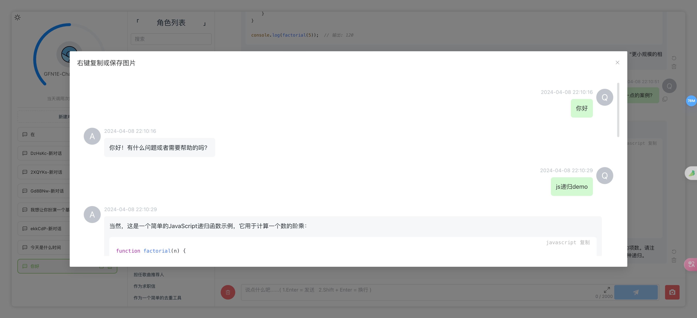
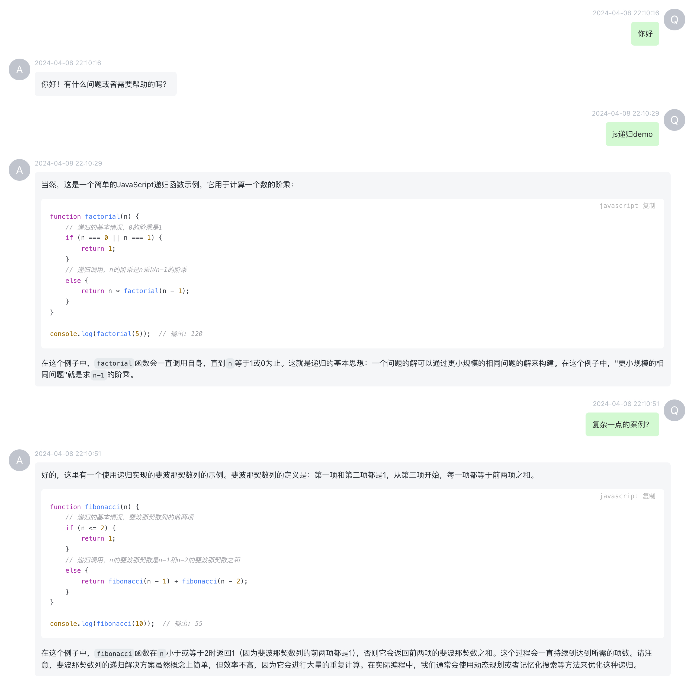
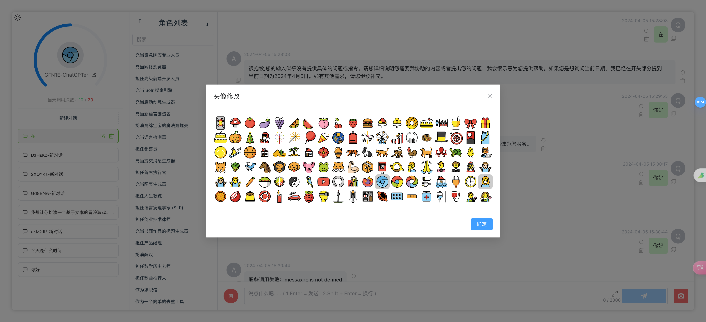
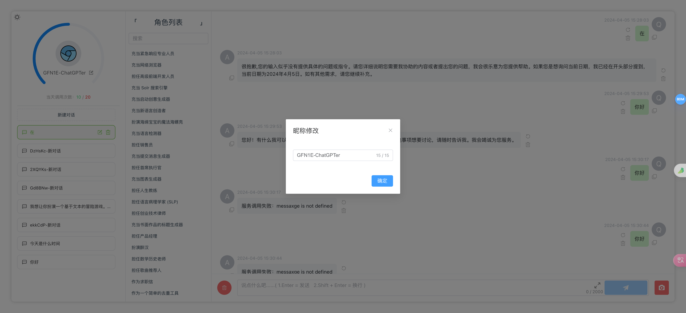
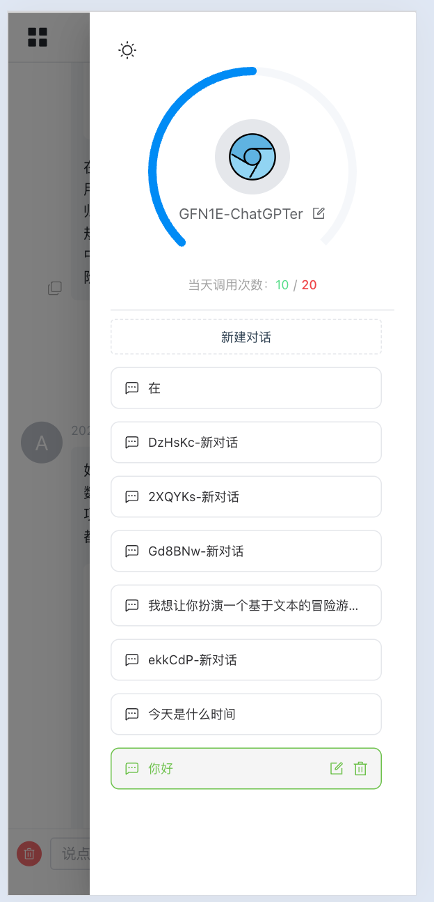
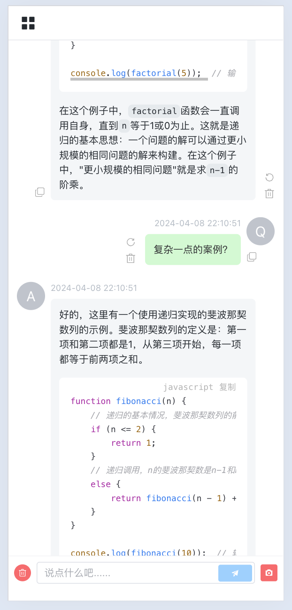

<div align="center">


# `EsChat` <!-- omit in toc -->


[](https://opensource.org/licenses/MIT)

<p class="align center">
<h4>一个快速上手且极易部署的类ChatGPT开源应用<br>可接入 <code>OPENAI API</code> 或 <code>通义千问API</code></h4>
</p>
</div>


## 版本特性 <!-- omit in toc -->

- [x] OPENAI 和 通义千问双模型可选
- [x] 支持暗黑主题 🌙
- [x] 完美的移动端兼容 📱
- [x] 打字机回复效果 ⌨️
- [x] 上下文对话支持，可创建多轮对话记录
- [x] 整段生成内容支持复制、代码复制、代码高亮
- [x] 双登录模式：
  - 1.关联公众号登录(个人订阅号即可) - 可实现公众号引流   
  - 2.普通的授权码登录模式(手动分发授权码) 
- [x] Lowdb 本地JSON数据库
- [x] 自定义调用次数及文本输入上限


> [!NOTE]
> **具体关于使用微信公众号实现网站授权登录的技术方案可参考如下文章，非常详细
[https://juejin.cn/post/7234394174274158650](https://juejin.cn/post/7234394174274158650)**


---
## 目录 <!-- omit in toc -->
- [前置要求](#前置要求)
  - [Node](#node)
  - [`.env` 配置文件](#env-配置文件)
    - [1.通义千问配置](#1通义千问配置)
      - [TY\_API\_KEY](#ty_api_key)
      - [TY\_MODEL](#ty_model)
    - [2.OPENAI相关配置](#2openai相关配置)
      - [GPT3\_BASE\_URL](#gpt3_base_url)
      - [GPT3\_API\_KEY](#gpt3_api_key)
      - [GPT3\_MODEL](#gpt3_model)
    - [3.用户配置及公众号相关](#3用户配置及公众号相关)
      - [WECHAT\_TOKEN](#wechat_token)
      - [JWT\_SECRET\_KEY](#jwt_secret_key)
      - [MAX\_LENGTH](#max_length)
      - [DAILY\_LIMIT](#daily_limit)
      - [网站登录 - 公众号二维码存放路径](#网站登录---公众号二维码存放路径)
- [截图展示](#截图展示)
  - [🏠 首页](#-首页)
  - [内容生成](#内容生成)
  - [保存为图片](#保存为图片)
  - [昵称头像修改](#昵称头像修改)
  - [移动端兼容](#移动端兼容)
- [技术栈](#技术栈)
  - [客户端](#客户端)
  - [服务端](#服务端)
- [目录结构](#目录结构)
  - [客户端](#客户端-1)
  - [服务端](#服务端-1)
- [安装部署](#安装部署)
  - [本地开发](#本地开发)
- [本地构建](#本地构建)
  - [Docker](#docker)
- [常见问题](#常见问题)
- [支持作者](#支持作者)
- [LICENSE](#license)

---


## 前置要求

### Node

`node` 需要 `^16 || ^18 || ^19` 版本（`node >= 14` 需要安装 [fetch polyfill](https://github.com/developit/unfetch#usage-as-a-polyfill)），使用 [nvm](https://github.com/nvm-sh/nvm) 可管理本地多个 `node` 版本

```bash
node -v
```

### `.env` 配置文件  

请参考 `server/.env.example` 文件，将配置项替换为实际值，并在相同目录下保存为 `.env` 文件  

以下 `通义千问` 和 `OPENAI` 二选一，默认优先取通义千问配置

#### 1.通义千问配置

##### TY_API_KEY
- **必须**: `true`
- **描述**: 用于访问通义千问平台的 apiKey。

##### TY_MODEL
- **必须**: `false`
- **默认值**: `qw-max`
- **描述**: 指定要调用的通义千问大语言模型。若不设置，将使用默认值 `qw-plus`。

#### 2.OPENAI相关配置

##### GPT3_BASE_URL
- **必须**: `false`
- **默认值**: `https://api.openai.com/v1`
- **描述**: gpt3服务的基础URL。如无特殊需求，建议使用默认值。

##### GPT3_API_KEY
- **必须**: `true`
- **描述**: openai平台提供的 API 密钥，用于访问 gpt3 服务。

##### GPT3_MODEL
- **必须**: `false`
- **默认值**: `gpt-3.5-turbo`
- **描述**: 指定使用的 gpt3 模型。如果不指定，系统将使用默认模型 `gpt-3.5-turbo`。

#### 3.用户配置及公众号相关

##### WECHAT_TOKEN
- **必须**: `true`
- **描述**: 对应微信公众号后台设置的 token，可按需自定义。

##### JWT_SECRET_KEY
- **必须**: `true`
- **描述**: 设置用于 jwt 鉴权的 secret key。

##### MAX_LENGTH
- **必须**: `true`
- **默认值**: `2000`
- **描述**: 用户允许的最大输入字符长度。默认限制为 2000 字符。

##### DAILY_LIMIT
- **必须**: `true`
- **默认值**: `20`
- **描述**: 每日调用接口的额度上限。默认设定为每日最多调用 `20` 次。

##### 网站登录 - 公众号二维码存放路径

`client/static/imgs/mp_qrcode.jpg`


## 截图展示

### 🏠 首页





### 内容生成



### 保存为图片





### 昵称头像修改





### 移动端兼容

<div align="center">
  
  
</div>

## 技术栈 

### 客户端  

`Vue3` + `Element Plus` + `Pinia` + `Unocss`


### 服务端

`Express` + `Lowdb`

## 目录结构

### 客户端

`/src/assets`  静态资源  

`/src/components` 公共组件  

`/src/hooks`   公共hooks  

`/src/router` 路由配置

`/src/service` 接口请求、响应拦截器

`/src/stores`  状态管理  

`/src/utils`   全局工具类

`/src/views`  页面

### 服务端

`/src/constant` 常量  

`/src/lowdb`   Lowdb本地数据库及配置
 - `user.ts`  用户数据库配置
 - `users.json`  用户数据库文件
 - `userServiceCall.ts` 用户调用记录数据库配置
 - `userServiceCall.json`  用户调用记录数据库文件

`/src/routes`  路由
  - `wechat.ts`  公众号验证、获取验证码、登录校验
  - `home.ts` status 状态校验
  - `chat.ts` 大模型对话
  - `user.ts` 用户信息相关

`/src/store`  node-cache配置，主要用于验证码的生成及校验

`/src/utils`  工具类

`.env.example`  配置文件示例，请务必创建自己的  `.env` 文件

`app.ts`  应用入口，可配置端口、跨域等

## 安装部署

### 本地开发

克隆项目

```bash
git clone git@github.com:isnl/EsChat.git
```

**服务端**

进入服务端根目录

```bash
cd server
```

安装依赖

```bash
npm install  
```

参考 `.env.example` ，在服务端根目录下新建 `.env` 文件，并配置环境变量  


启动服务端

```bash
npm run dev
```
---

**客户端**

进入客户端根目录

```bash
cd client
```

安装依赖

```bash
npm install  
```

启动客户端

```bash
npm run dev
```
---

## 本地构建

**客户端构建**

进入客户端根目录
```bash
cd client
```

执行构建命令
```bash
npm run build
```

此时会在服务端根目录生成客户端的构建产物 `clientDist`

---

**服务端构建**

进入服务端根目录
```bash
cd server
```

执行构建命令
```bash
npm run build
```

此时会在服务端根目录产生两个构建产物 `app.mjs` 和 `app.mjs.map`  

接下来使用如下命令启动服务即可  
```bash
npm start
```

当然，你也可以使用 `pm2` 来守护进程，防止进程被杀死  

```bash
pm2 start npm --name ai -- start
```

### Docker

```bash
docker pull webpeanut/eschat

docker run -d --name eschat \
  -p 3100:3100  \
  -e TY_API_KEY=YOUR_TY_API_KEY \
  -e TY_MODEL=qwen-turbo  \
  -e WECHAT_TOKEN=YOUR_WECHAT_TOKEN  \
  -e JWT_SECRET_KEY=YOUR_JWT_SECRET_KEY  \
  -e MAX_LENGTH=2000  \
  -e DAILY_LIMIT=20  \
  webpeanut/eschat
```

如果你需要指定其他环境变量，请自行在上述命令中增加 -e 环境变量=环境变量值 来指定。

## 常见问题

`Q`： 部署后为啥不是流式响应

`A`： 检查 `nginx` 配置  

```nginx
proxy_buffering off;
chunked_transfer_encoding on;
tcp_nopush on;
tcp_nodelay on;
keepalive_timeout 65;
```

---


`Q`： 授权码登录方式，授权码在哪创建？

`A`： `/server/db/user.json`，`openId` 为授权码字段，自行生成即可，长度和内容随机，确保唯一性即可

```json
{
  "openId": "nf71b7-nsh167-7n21b1",
  "id": "poRElv1koxGkvYriOlM61",
  "avatar": "E053",
  "name": "GFN1E-ChatGPTer",
  "createdAt": "2024-04-05 15:38:15"
}
```

---

`Q`： 除了微信公众号和授权码登录方式外，能不能让用户自己注册账号自行使用？

`A`： 用户相关模块逻辑很清晰，自行开发注册相关功能即可

---

`Q`： 能不能给指定的用户单独设置每日调用次数和文本长度限制？

`A`： 需要写点代码，将调用次数和文本长度字段存入数据库中的用户表里。在你使用的模型 chat 路由模块（`server/src/routes/chat/xxx`），先根据id获取到用户信息，再将调用次数和文本长度限制改为从用户信息中获取的方式即可  

- process.env.MAX_LENGTH -> 用户信息中的 MAX_LENGTH
- process.env.DAILY_LIMIT -> 用户信息中的 DAILY_LIMIT

---

`Q`： Docker部署，如何查看镜像文件夹中的内容，例如查看数据库？

`A`： 要查看 Docker 镜像中的内容，你可以通过以下步骤操作：

首先，使用以下命令列出本地的 Docker 镜像：  
  
```bash
docker images
```

找到你想要查看的镜像的 REPOSITORY 和 TAG。

使用以下命令创建并启动一个临时容器，使得你能够在其中查看镜像中的文件内容：
```
docker run -it --rm webpeanut/eschat sh
```

这将创建并启动一个新的容器，并进入容器的 shell 命令行界面。  

在容器的命令行界面中，你可以使用标准的 Linux 命令来查看镜像中的文件内容，例如 `ls` 命令来列出目录中的文件。

通过以上步骤，你可以在容器中查看 Docker 镜像中的文件内容。

---

`Q`： 没有服务器和域名怎么办？

`A`： 买！阿里云现在服务器价格新老用户都很便宜
2核4G，5M固定带宽，80G ESSD Entry盘一年只需要`199`（企业用户），2核2G，3M固定带宽，40G ESSD Entry盘只需 `99`(个人企业同享)  
不是哥们，这价格你敢信！！！ 最重要的是 `续费同价`，这你受得了吗！

当然，新用户更优惠，`.com域名 + 2核2G ECS包年` 只需 `99`，`99` 你买不了吃亏，买不了上当

[点击即刻购买](https://www.aliyun.com/daily-act/ecs/activity_selection?userCode=56gyhchh)

## 支持作者

`EsChat` 是一款完全免费无广告的开源软件，软件开发和维护全靠作者用爱发电，因此您可以选择支持作者让作者有更多的热情和精力维护此软件，或者您使用了此软件进行了盈利，欢迎您通过下面的方式支持作者：

<div align="center">


</div>

## LICENSE

[MIT](https://opensource.org/license/mit/)


